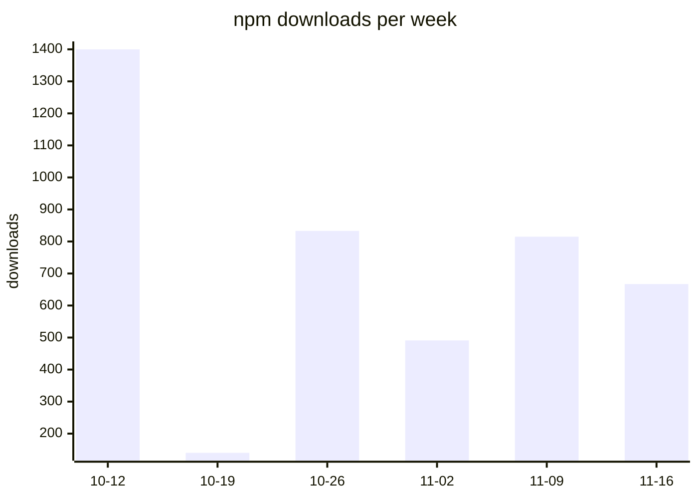
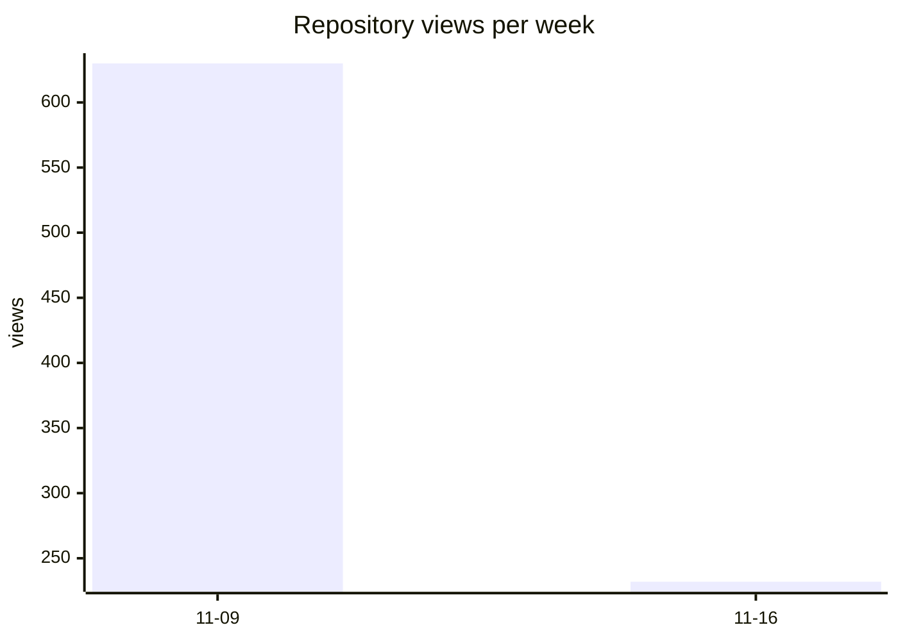

# Usage stats

Updated 2026-11-25 by the Usage stats workflow on `main`. The counts are what npm and GitHub publish; nothing is collected from the server or its users.

| | Last 7 days | Last 30 days |
| --- | --- | --- |
| npm downloads | 301 | 2868 |
| Repository views | 165 | — |
| Repository clones | 402 | — |

A dash means coverage is incomplete. Each total covers full UTC days through yesterday.

Claude Desktop extension downloads, all releases: 376.

Docker image downloads from ghcr.io, all versions: 229 (as of 2026-11-25).

npm counts every download, including CI runs, mirrors and repeated `npx` installs, and ghcr.io counts every image pull, so read them as a trend rather than a number of users. Daily unique visitors cannot be added up into unique visitors for a longer period.

## GitHub reach and referrers

GitHub’s rolling 14-day window, recorded on 2026-11-25 (UTC).

Unique repository visitors: 150. Unique cloners: 314.

| Top referring sites | Views | Unique visitors |
| --- | ---: | ---: |
| reddit.com | 59 | 39 |
| github.com | 44 | 11 |
| Google | 23 | 21 |
| teams.public.onecdn.static.microsoft | 9 | 8 |
| t.co | 8 | 7 |
| com.reddit.frontpage | 7 | 5 |
| ecosia.org | 3 | 3 |
| Bing | 1 | 1 |
| DuckDuckGo | 1 | 1 |

```mermaid
xychart-beta
  title "npm downloads per week"
  x-axis ["10-12", "10-19", "10-26", "11-02", "11-09", "11-16"]
  y-axis "downloads"
  bar [1400, 140, 833, 491, 815, 667]
```

```mermaid
xychart-beta
  title "Repository views per week"
  x-axis ["11-09", "11-16"]
  y-axis "views"
  bar [630, 232]
```

Files: `npm-downloads.csv`, `github-traffic.csv`, `github-traffic-windows.csv` and `referrers.csv` (14-day snapshots), `extension-downloads.csv` (running totals per release), `image-downloads.csv` (running totals of the Docker image).
